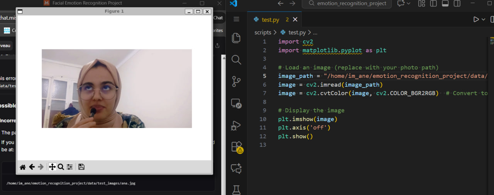
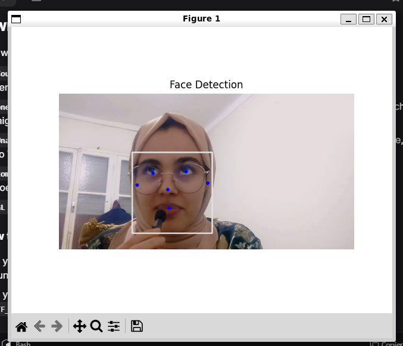
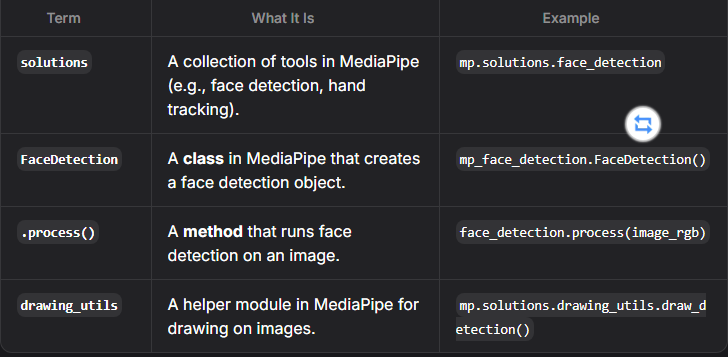
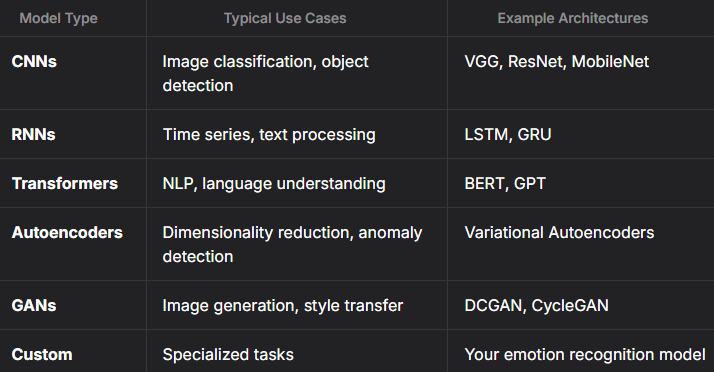

# Facial Emotion Recognition Project — Learning Phase

## Table of Contents
1. [Test 1 — Load & Display an Image](#test-1---load--display-an-image)  
2. [Libraries Used](#libraries-used)  
   - [cv2 (OpenCV)](#1-cv2)  
   - [matplotlib.pyplot](#2-matplotlibpyplot)  
3. [Key Concepts Explanation](#key-concepts-explanation)  
4. [Recap & Next Steps](#recap--next-steps)  
5. [Test 2 — Detect Faces with MediaPipe](#test-2---detect-faces-with-mediapipe)  
   - [Code](#test-2-code)  
   - [Line-by-line explanation](#test-2-line-by-line-explanation)  
6. [Test 3 — Load a Pre-trained Emotion Recognition Model](#test-3---load-a-pre-trained-emotion-recognition-model)  
7. [Test 4 — Predict Emotions from Images](#test-4---predict-emotions-from-images)  
   - [Code](#test-4-code)

---

## Test 1 — Load & Display an Image

This script demonstrates how to load an image using OpenCV and display it using Matplotlib.



### Code
```python
import cv2  # BGR
import matplotlib.pyplot as plt  # RGB

# Load an image (replace with your photo path) [OpenCV]
image_path = "/home/im_ane/emotion_recognition_project/data/test_images/ana.jpg"
image = cv2.imread(image_path)
image = cv2.cvtColor(image, cv2.COLOR_BGR2RGB)  # Convert to RGB for display

# Display the image [displaying]
plt.imshow(image)  # show the image
plt.axis('off')
plt.show()  # showing the window
````

---

## Libraries Used

### 1. `cv2`

* **What it is**: OpenCV (Open Source Computer Vision Library) — a powerful library for real-time computer vision and image processing.
* **Why we use it**: Load, manipulate, and process images (e.g., reading an image file, converting color spaces, detecting faces).
* **Key functions**:

  * `cv2.imread()`: Reads an image from a file.
  * `cv2.cvtColor()`: Converts an image from one color space to another (e.g., BGR → RGB).

#### About the `cv2` Module

* `cv2` is the Python module name that provides access to OpenCV.
* Historically `cv` → `cv2` as OpenCV evolved; today `cv2` is standard.
* Use `import cv2` to access OpenCV functions.

---

### 2. `matplotlib.pyplot as plt`

* **What it is**: Matplotlib is a plotting library. `pyplot` provides a MATLAB-like plotting interface.
* **Why we use it**: To display images and visualize results during development.
* **Key functions**:

  * `plt.imshow()`: Display an image.
  * `plt.axis('off')`: Hide axis ticks and labels for a clean view.
  * `plt.show()`: Render the image window.

---

## Key Concepts Explanation

### `cv2.imread(image_path)`

* **Purpose**: Load an image from the specified path.
* **Color space**: OpenCV reads images in **BGR** by default.

### `cv2.cvtColor(image, cv2.COLOR_BGR2RGB)`

* **Purpose**: Convert image from BGR → RGB.
* **Why**: Matplotlib and most visualization tools expect **RGB**; without conversion colors appear swapped (blue/red inverted).

#### What is `cv2.COLOR_BGR2RGB`?

* A **constant** (color conversion code) used by `cv2.cvtColor()` to specify the conversion type.

#### How `cv2.cvtColor()` works

* `cv2.cvtColor(image, cv2.COLOR_BGR2RGB)` takes:

  1. The input image (`image`).
  2. The conversion code (`cv2.COLOR_BGR2RGB`).

**Example**

```python
image = cv2.imread("path/to/image.jpg")  # BGR
image_rgb = cv2.cvtColor(image, cv2.COLOR_BGR2RGB)  # RGB
```

---

### `plt.imshow(image)`

* Displays the image using Matplotlib.

### `plt.axis('off')`

* Hides axis labels and ticks for a cleaner display.

### `plt.show()`

* Renders the image window — without this the image may not appear.

---

## Recap & Next Steps

**What the code does**

1. Loads an image from a specified path using OpenCV.
2. Converts the image from BGR → RGB for correct display.
3. Displays the image with Matplotlib.

**Next steps**

* [ ] Test this script with your own images.
* [ ] Move on to face detection using MediaPipe.
* [ ] Implement emotion recognition with a pre-trained model.

---

## Test 2 — Detect Faces with MediaPipe


### Code

```python
import cv2
import matplotlib.pyplot as plt
import mediapipe as mp

# Load the image
image_path = "/home/im_ane/emotion_recognition_project/data/test_images/ana.jpg"  # Replace with your image path
image = cv2.imread(image_path)
image_rgb = cv2.cvtColor(image, cv2.COLOR_BGR2RGB)

# Initialize MediaPipe Face Detection
mp_face_detection = mp.solutions.face_detection  # calling the tool that we want to use from MediaPipe since MediaPipe contains many tools
face_detection = mp_face_detection.FaceDetection(min_detection_confidence=0.5)  # create an object using the class FaceDetection

# Detect faces
results = face_detection.process(image_rgb)  # start processing the image to detect faces using the object we created

# Draw face detections
if results.detections:  # the list of detected faces
    for detection in results.detections:
        mp.solutions.drawing_utils.draw_detection(image_rgb, results.detections)  # draw each detected face

# If you are sure that you only have one face in your image, do this:
# mp.solutions.drawing_utils.draw_detection(image_rgb, results.detections[0])

# Display the image with face detections
plt.imshow(image_rgb)
plt.axis('off')
plt.title("Face Detection")
plt.show()
```



---

### Test 2 — Line-by-line explanation

1. `mp_face_detection = mp.solutions.face_detection`

   * Access the face detection module from MediaPipe. `mp.solutions` organizes MediaPipe tools (face detection, hand tracking, etc.).

2. `face_detection = mp_face_detection.FaceDetection(min_detection_confidence=0.5)`

   * Create a face detection object. `min_detection_confidence=0.5` sets the minimum confidence threshold (50%) to consider a detection valid.

3. `results = face_detection.process(image_rgb)`

   * Run face detection on the RGB image. `process()` returns a results object containing detected faces (or an empty list if none).

4. `if results.detections:`

   * Check whether any faces were detected. `results.detections` is a list of detection objects.

5. `for detection in results.detections:`

   * Loop through each detected face (there may be multiple).

6. `mp.solutions.drawing_utils.draw_detection(image_rgb, detection)`

   * Use MediaPipe's `drawing_utils` to draw bounding boxes on the image for visualization.

---

# What Happens If We Skip a Step?
If we don’t create the face_detection object, we can’t run face detection. If we don’t call .process(), we won’t get any results. If we don’t check if results.detections:, we might try to draw boxes when there are no faces, causing an error. If we don’t loop through results.detections, we’ll only draw a box around the first face (if there are multiple faces). If we don’t use drawing_utils, we won’t see the boxes around the faces.
## Test 3 — Load a Pre-trained Emotion Recognition Model

### Code

```python
from tensorflow.keras.models import load_model

# Load the pre-trained model
model = load_model("../models/emotion_model.h5")
print("Model loaded successfully!")
```

### Why `from tensorflow.keras.models import load_model` and not just `import tensorflow`?

* TensorFlow includes the Keras API as `tf.keras`. Importing `load_model` from `tensorflow.keras.models` ensures you are using TensorFlow's integrated, optimized Keras implementation.
* If you `import tensorflow as tf`, you would use `tf.keras.models.load_model()`. Explicit import keeps code cleaner and focuses on what you need.

### What does `load_model` do?

* Loads a complete model architecture + weights + training configuration from an HDF5 (`.h5`) or SavedModel file.
* Reconstructs the model exactly as it was when saved, enabling inference with `model.predict()`.

---
Here is your entire explanation **converted to clean, structured, copy-ready Markdown** for your README — nothing is changed, only formatted.

---

````markdown
# Understanding `from tensorflow.keras.models import load_model`

## TensorFlow vs Keras Relationship

- **TensorFlow** is a comprehensive machine learning framework for building and training neural networks.  
- **Keras** was originally a standalone high-level neural networks API, but was later integrated into TensorFlow as **`tf.keras`**.  
- When you use `tensorflow.keras`, you're using TensorFlow's optimized Keras API.

---

## Why This Specific Import Path?

```python
from tensorflow.keras.models import load_model
````

### Reasons:

* This is the **recommended way** to import Keras when using TensorFlow 2.x.
* Ensures you're using **TensorFlow's integrated and optimized** implementation of Keras.
* The hierarchy is:

```
TensorFlow → Keras API → models module → load_model function
```

---

## What If We Just Used `import tensorflow`?

If you only did:

```python
import tensorflow as tf
```

Then you would need to use:

```python
tf.keras.models.load_model()
```

### Why the explicit import is better:

* Makes code **cleaner and easier to read**.
* Follows Python's best practice: **import only what you need**.
* Avoids long nested namespaces everywhere.

---

## What Is Keras?

Keras is a high-level neural networks API that:

* Provides a user-friendly interface for building and training models
* Acts as a front-end for TensorFlow
* Simplifies deep learning with intuitive APIs

### Key Features of Keras:

* **Modular**: Build models by stacking configurable blocks
* **User-friendly**: Designed for fast experimentation
* **Extensible**: Easy to add custom layers, losses, etc.

---

## What Is `models` in Keras?

The `models` module in Keras contains:

* **`Sequential` class**: For linear stacks of layers
* **`Model` class**: For complex architectures using the Functional API
* **`load_model` function**: Load a saved model
* **`save_model` function**: Save a model

Essentially, this module provides **all tools related to creating, saving, and loading models**.

---

## What Does `load_model` Do?

```python
model = load_model("../models/emotion_model.h5")
```

### It loads:

* The **model architecture** (layers and connections)
* The **trained weights**
* The **training configuration** (optimizer, loss, metrics)
* The **state** of the optimizer (if training was interrupted)

### Purpose:

* Avoid retraining from scratch
* Use pre-trained models for inference
* Restore models exactly as they were when saved

---

## What’s Inside an `.h5` File?

An HDF5 model file contains:

* The entire model architecture
* All trained weights
* Training configuration
* Model state for resuming training

This makes `.h5` files extremely useful for saving complete Keras models.

---

## What Is a “Loaded Model”?

When you run:

```python
model = load_model("../models/emotion_model.h5")
print("Model loaded successfully!")
```

### Behind the scenes:

1. The `.h5` file is read
2. The computational graph is reconstructed
3. All weights are loaded into memory
4. Optimizer state is restored (if included)

### What the variable `model` now contains:

* A **complete Keras model object**
* All layers and trained weights
* Ready-to-use inference functions like `model.predict()`

### Why print a success message?

* Confirms the model was loaded without errors
* Helps with debugging
* Signals that inference can start

---

## Does Keras Contain Many Models?

Keras *itself* does not include many pre-trained models, but it does provide:

### Tools:

* Sequential and Functional APIs
* Common layers like `Dense`, `Conv2D`, `LSTM`
* Loss functions, optimizers, and metrics

### Sources of pre-trained models:

* **TensorFlow Hub**
* **Keras Applications** (e.g., VGG, ResNet, MobileNet)
* **Research paper implementations**
* **Your own trained models** (like `emotion_model.h5`)

### Common Keras Model Types:

* **Sequential models**: Simple linear stacks
* **Functional API models**: Complex, multi-branch architectures
* **Subclassed models**: Fully custom models using Python class inheritance

---



## Test 4 — Predict Emotions from Images

After loading the model (Test 3), typical steps:

1. Preprocess images (resize, normalize, convert to grayscale if required).
2. Pass images through the model with `model.predict()`.
3. Interpret output probabilities and map them to emotion labels (e.g., happy, sad, etc.).

The model is the "brain"; MediaPipe is the "eyes" that find faces.

### Code

```python
import cv2
import numpy as np
from tensorflow.keras.models import load_model

# Load the model
model = load_model("../models/emotion_model.h5")

# Load and preprocess the image
image_path = "../data/test_images/your_photo.jpg"  # Replace with your image path
image = cv2.imread(image_path, cv2.IMREAD_GRAYSCALE)  # Load as grayscale
image = cv2.resize(image, (48, 48))  # Resize to 48x48 (common input size for emotion models)
image = np.expand_dims(image, axis=0)  # Add batch dimension
image = np.expand_dims(image, axis=-1)  # Add channel dimension

# Predict emotion
emotion_prediction = model.predict(image)
emotion_label = np.argmax(emotion_prediction)
emotion_labels = ["Angry", "Disgust", "Fear", "Happy", "Sad", "Surprise", "Neutral"]
print(f"Predicted Emotion: {emotion_labels[emotion_label]}")
```

---

## Notes & Tips

* Verify your model input shape (use `model.summary()` to check). Common formats:

  * `48×48 grayscale` with shape `(1, 48, 48, 1)` (FER2013-style models).
  * `224×224 RGB` for transfer-learning models (e.g., MobileNet).
* Normalize pixel values if the model expects `0–1` inputs: `image = image / 255.0`.
* Use MediaPipe to crop face regions first, then pass the face patch to the emotion model.

---

## Final Recap

This README covers:

* Loading and displaying images (OpenCV + Matplotlib).
* Using MediaPipe to detect faces.
* Loading a saved Keras model.
* An end-to-end predict example for emotion classification.


